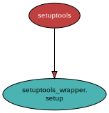

<!--
    =====================================
    generator=datazen
    version=2.1.0
    hash=83be1d7da7f3467ef6677de2ce3ffee4
    =====================================
-->

# setuptools-wrapper ([0.1.1](https://pypi.org/project/setuptools-wrapper/))

*A simple interface to setuptools's setup function.*

See also: [generated documentation](https://vkottler.github.io/python/pydoc/setuptools_wrapper.html)
(created with [`pydoc`](https://docs.python.org/3/library/pydoc.html)).

That's it. I personally think there are way too many configuration options when
"packaging" software and I want to homogenize my own packages. Thus:
`setuptools-wrapper`.

# Internal Dependency Graph

A coarse view of the internal structure and scale of
`setuptools-wrapper`'s source.
Generated using [pydeps](https://github.com/thebjorn/pydeps) (via
`mk python-deps`).

