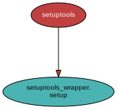

<!--
    =====================================
    generator=datazen
    version=3.1.0
    hash=58daa1cc83ef090fe166a8ee588b7392
    =====================================
-->

# setuptools-wrapper ([0.2.2](https://pypi.org/project/setuptools-wrapper/))

*A simple interface to setuptools's setup function.*

See also: [generated documentation](https://vkottler.github.io/python/pydoc/setuptools_wrapper.html)
(created with [`pydoc`](https://docs.python.org/3/library/pydoc.html)).

## Python Version Support

This package is tested with the following Python minor versions:

* [`python3.7`](https://docs.python.org/3.7/)
* [`python3.8`](https://docs.python.org/3.8/)
* [`python3.9`](https://docs.python.org/3.9/)
* [`python3.10`](https://docs.python.org/3.10/)

## Platform Support

This package is tested on the following platforms:

* `ubuntu-latest`
* `macos-latest`
* `windows-latest`

# Introduction

That's it. I personally think there are way too many configuration options when
"packaging" software and I want to homogenize my own packages. Thus:
`setuptools-wrapper`.

# Internal Dependency Graph

A coarse view of the internal structure and scale of
`setuptools-wrapper`'s source.
Generated using [pydeps](https://github.com/thebjorn/pydeps) (via
`mk python-deps`).

